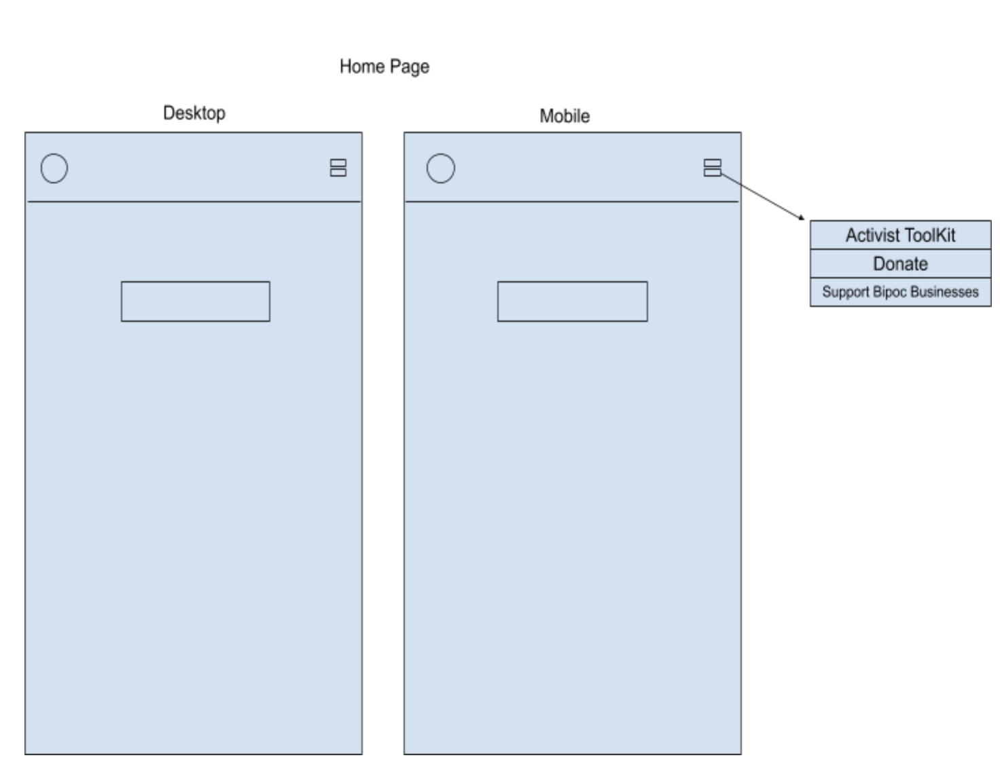
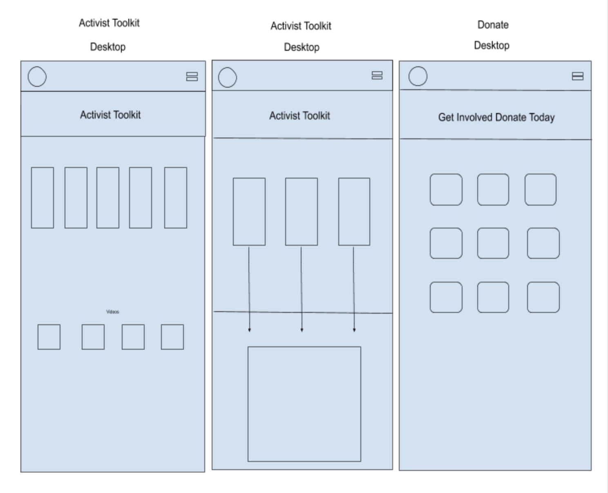
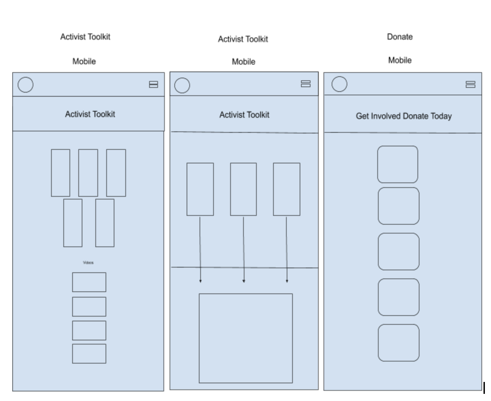
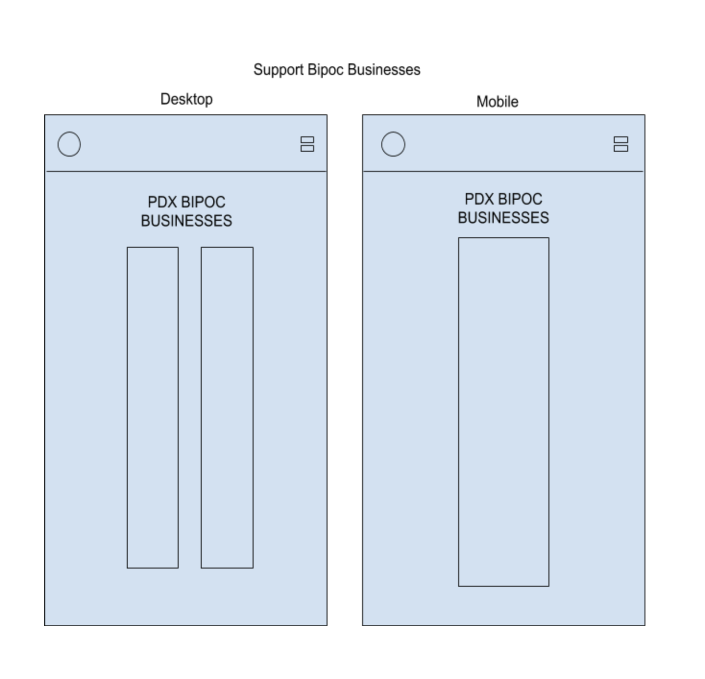
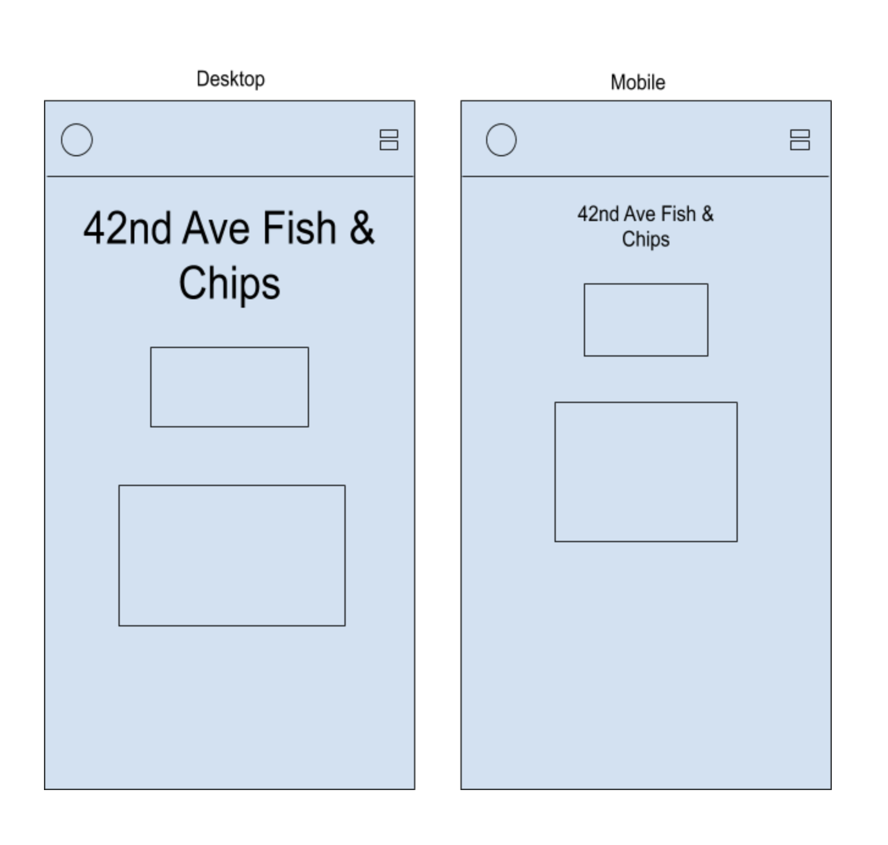
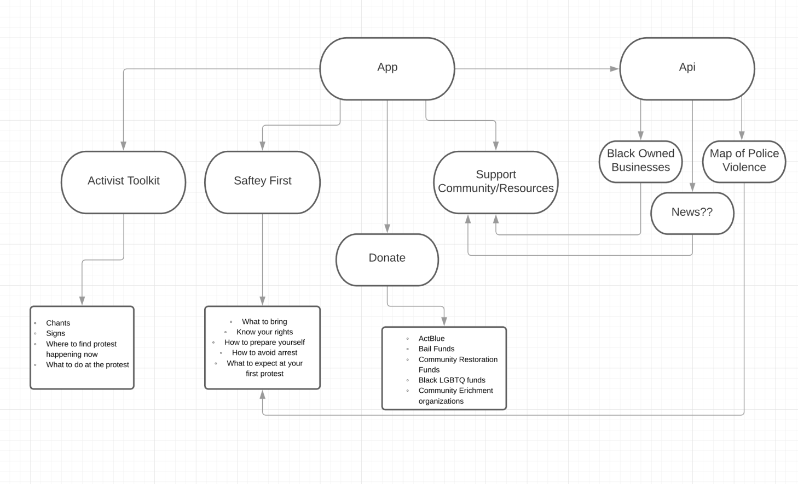
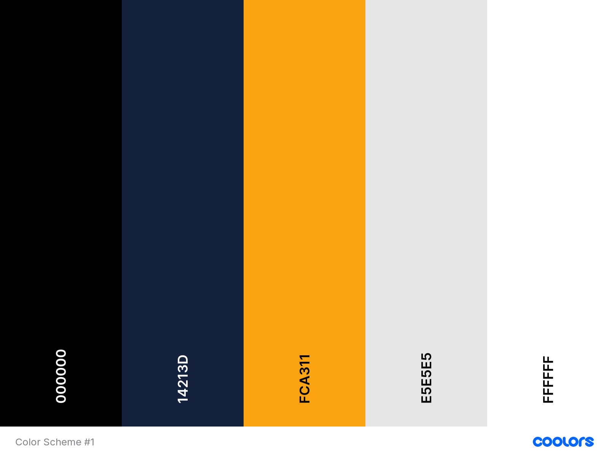

# PROtester

#### By Dan Merys, Celeste Field, Tyler Bowerman, Austin Butler & Reid Ashwill

## Description

This app is designed to be a useful tool to be used by activists.  While large scale protests have been happening in every major city in the US, and even stretching globally, currently this app is centered on activity in Portland, OR USA.  It is our hope to give less experienced activists the tools and knowledge that they need to be safe while expressing themselves.

## User Stories

As a user I want to be able to see infographics with safety tips.

As a user I want to see examples of signs I could make, and effective chants.

As a user I want to see a list of organizations that are active in the current political sphere and links to their donations pages.

As a user I want to see a list of BIPOC owned businesses that I can support.

## Page Layout

## Componet Diagram

## Color Scheme

## Setup/Installation Requirements

* _Navigate to https://github.com/bowty14/PROtester_
* _Clone the respository to your local machine_
* _Navigate to the cloned directory and open in your text editor of choice to view code_
* _Run the command 'bundle install' to install all gems used in this project_
* _Run the command 'rake db:create' to start the postgresql database_
* _Run the command "rails s" to start a local rails server_
* _Navigate your browser of choice to localhost:3000_

* _Navigate your browser of choice to https://protester.herokuapp.com/ to see the live deployment_

## API's

This app currently uses two API's.  The Google Maps API, and our own PDX BIPOC Owned Businesses API (https://github.com/reidashwill/team_week_api), which was designed from the ground up to work in concert with this app.

The API we designed is currently hosted live at https://harbor-14009.herokuapp.com/[your-endpoint-here] and is free for anyone to use in their projects.

## Known Bugs
No known bugs at this time

## Technologies Used

* _Ruby_
* _Rails_
* _HTML (erb)_
* _Bootstrap / SASS_
* _API's_
* _Canva Online Design_
* _HTTParty gem_

### License

*Licensed under the MIT license*

Copyright (c) 2020 **_Dan Merys, Celeste Field, Tyler Bowerman, Austin Butler & Reid Ashwill_**